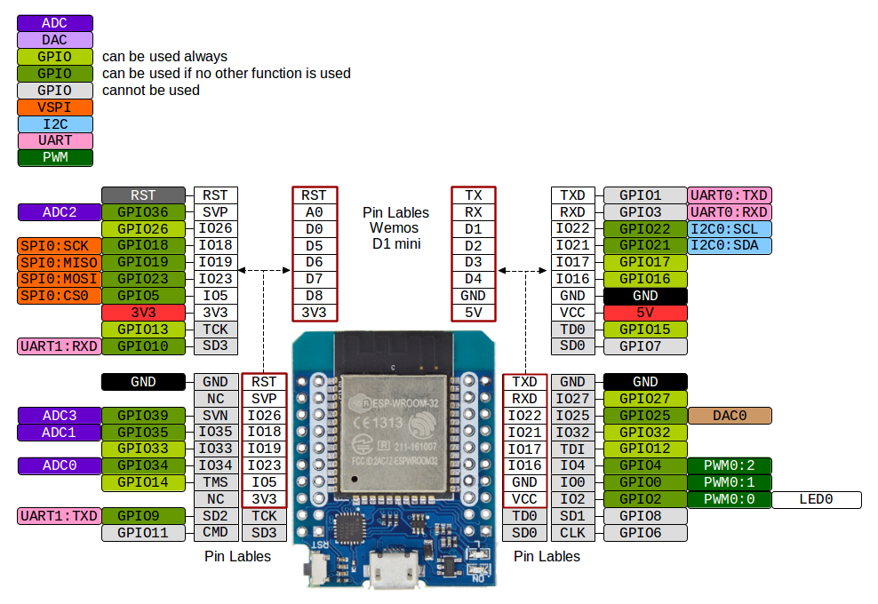
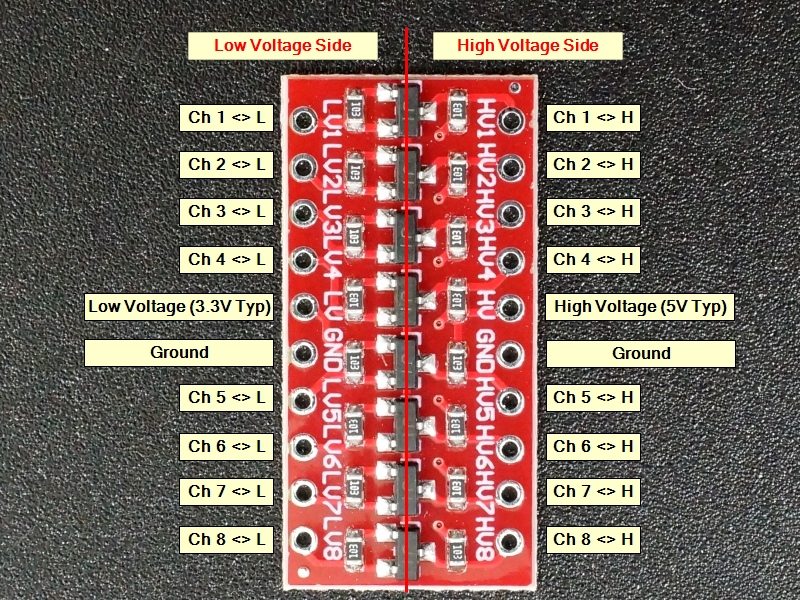
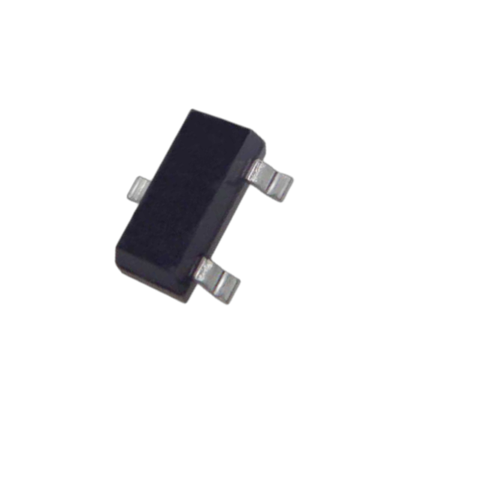
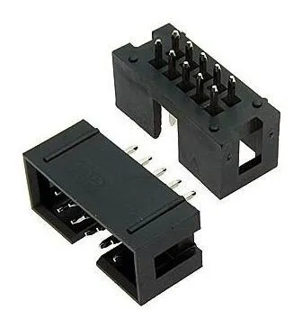
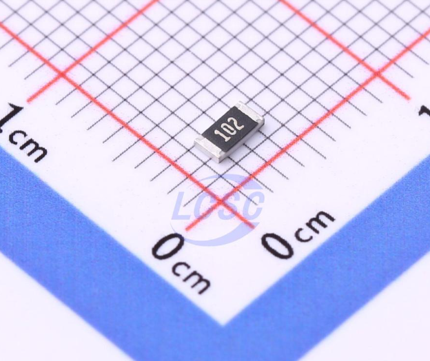
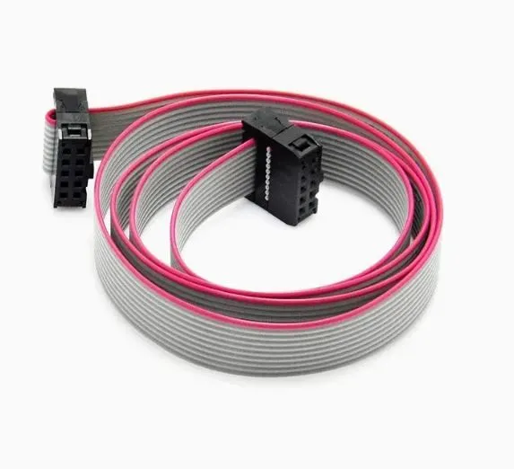
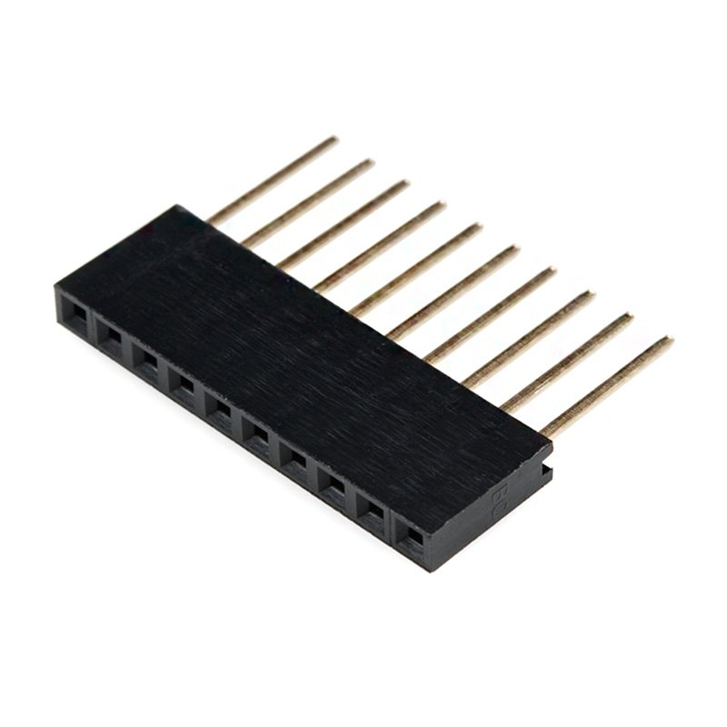
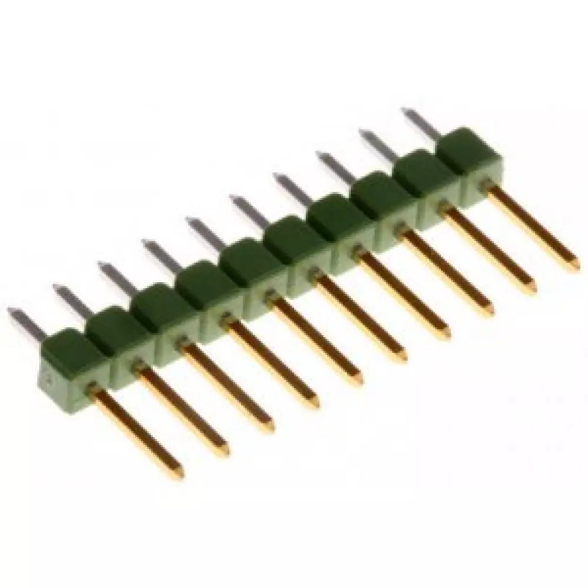
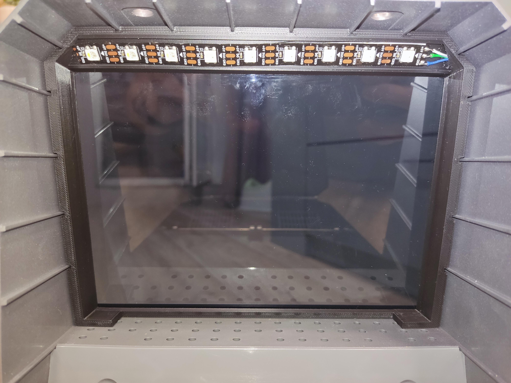

# Creality-Pi-Space-ESPHome

[English version](#english-version)

Мониторинг и управление сушилкой для филамента **Creality Pi Space** (и версии **Plus**) с помощью `ESP32` и `ESPHome`.

---

## Обзор

Интеграция сушилки `Creality Pi Space/Plus` в умный дом через `Home Assistant` и `ESPHome` с расширенными возможностями визуальной индикации и защиты от ошибок.

---

## Возможности

### Мониторинг
- 📊 Текущая и заданная температура
- 💧 Влажность
- ⏱️ Оставшееся время сушки
- 🎯 Выбранный материал
- 🔌 Статус устройства
- ⚠️ Расширенная обработка ошибок (**E1-E4**)

### Управление
- 🔘 Эмуляция 4 кнопок (Power, Up, Down, Set)
- 🤖 Автоматический полный цикл сушки
- 🌡️ Автосушка по влажности
- 🔌 Автовключение питания
- 🛡️ **Режим защиты от ошибки E4**
- 📱 Полное управление через Home Assistant

### Визуальная индикация
- 🌈 **Адресная LED подсветка SK6812** (9 светодиодов)
- 🔴 Индикация ошибок (красное мигание)
- 🟢 Адаптивная подсветка по влажности
- 🔵 Индикация выполнения скриптов
- ⚡ Эффекты и анимации

### Технические особенности
- 🔍 Перехват протокола I2C между дисплеем и платой управления
- 🌐 Веб-интерфейс ESPHome для локального мониторинга
- 📡 Полная интеграция с Home Assistant
- ⚡ Работа в реальном времени
- 🏗️ **ESP-IDF framework** 
- 🔧 **Новая печатная плата** 

---

## Компоненты

### Обязательные:

- **MH-ET LIVE D1 mini ESP32** — основной контроллер  
  

- **Преобразователь логических уровней (8-канальный) на транзисторах BSS138** — критически важно!  
  Для безопасного подключения ESP32 (3.3В) к логике сушилки (5В)  
  

- **Транзисторы для управления кнопками: IRLM6402 (P-channel MOSFET) - 4шт.**  
  

- **Разъем IDC-10 FEMALE — 2шт.**  
  Обязательно убедитесь в правильности ориентации и подключения шлейфа к этим разъёмам!  
  Ошибки подключения могут привести к замыканию или повреждению устройства.  
  

- **Резистор 1206 SMD 1кОм — 2шт.**  
  

- **Шлейф 10-pin**  
  Используется шлейф длиной около 10 см, ориентация разъёмов у него одинакова с обеих сторон..  
  

- **Штыревой разъём (гребёнка) 1×10, шаг 2.54 мм, «мама» (Female Header) - 4 шт.**  
  Опционально для монтажа на плату и подключения/вставки контроллера ESP32.  
  

- **Штыревой разъём (гребёнка) 1×10, шаг 2.54 мм, «папа-папа» (Male Pin Header, Double-Sided) - 4 шт.** 
  Используется для установки на модуль с ESP32.  
  

### Не обязательные:

- **🌈 Адресная LED лента SK6812 5V** — 9 светодиодов для визуальной индикации
- **🔌 Блок питания HLK-PM01** — дополнительное питание для LED подсветки
- **📦 3D печатные держатели:**
  - `PCB holder.stl` — держатель печатной платы
  - `HLK-PM01 holder.stl` — держатель блока питания
  - `LED frame.stl` — рамка для LED ленты
- **🔧 Новая печатная плата** —  (файлы в папке `Gerber/`)

---

## ⚠️ Статус проекта

Проект является **экспериментальным** и собран из доступных компонентов. В коде использованы программные «хаки» для стабилизации показаний из-за неидеальной работы преобразователя уровней. Проект обновлен с переходом на ESP-IDF framework и добавлением визуальной индикации. Включает улучшенную стабильность работы и расширенные возможности мониторинга.

---

## Принцип работы

- `ESP32` подключается к шине I2C между дисплеем и платой управления.
- Перехватывает и декодирует пакеты данных в реальном времени.
- Публикует состояния в Home Assistant через API ESPHome.
- Управляет кнопками через транзисторы, замыкая их на +5В.
- **Контролирует LED подсветку** для визуальной индикации состояния.
- **Защищает от ошибки E4** путем периодического циклирования через меню.

---

## Схема подключения

---

## Установка

> ⚠️ **Внимание!**
> Вы используете этот проект **на свой страх и риск**. Автор не несет ответственности за возможные повреждения вашего оборудования.

### Шаги:

1. **Соберите схему согласно диаграмме.**
2. **Прошейте `ESP32` через ESPHome (протестировано на версии `2025.9`):**
   - Основной конфиг: `esphome/en/creality-pi-space-plus.yaml`
   - Кастомный компонент: `external_components/i2c_creality_pi_dryer/` 
3. **Настройте LED подсветку:**
   - Подключите адресную ленту SK6812 к GPIO18
   - Подключите питание 5V от блока HLK-PM01
   - Установите 3D держатели для компонентов
4. **Добавьте устройство в Home Assistant.**
5. **Настройте автоматизации и интерфейс по своему усмотрению.**

---

## Новые функции

### 🌈 Адресная LED подсветка
- **9 светодиодов SK6812** для визуальной индикации
- **Адаптивная подсветка** по уровню влажности (красный = высокая влажность, зеленый = низкая)
- **Индикация ошибок** — красное мигание при обнаружении ошибок E1-E4
- **Индикация выполнения скриптов** — сине-красное мигание
- **Настраиваемые эффекты** и анимации

### 🛡️ Расширенная защита от ошибок
- **Обработка всех ошибок E1-E4** с визуальной индикацией
- **Режим защиты от E4** — автоматическое циклирование через меню для предотвращения перегрева
 

### 🔧 Технические улучшения
- **ESPHome 2025.9** с поддержкой ESP-IDF
- **Новая печатная плата** 
- **Дополнительное питание** для LED подсветки
- **3D модели** для удобного монтажа компонентов

### 🤖 Автоматический полный цикл
- Автоматически включает сушилку.
- Выбирает нужный материал.
- Устанавливает время сушки.
- Запускает процесс одной кнопкой в Home Assistant.

### 🌡️ Автосушка по влажности
- Запускает сушку при превышении заданного порога влажности.
- Настраиваемый порог (20–80%).
- Настраиваемая длительность (1–48 ч).
- Период охлаждения: 1 час между циклами для корректных измерений.
- Можно отключить в настройках устройства.

### 🔌 Автовключение
- Поддерживает сушилку всегда включенной.
- Автоматически включает устройство, если оно было выключено.
- Проверка статуса каждые 30 секунд.
- Можно отключить в настройках.

### 📊 Улучшенный мониторинг
- Отображение ошибок (`E1-E4` — различные типы ошибок).
- Индикация выполнения скриптов.
- Отображение статусов автоматических функций.
- **Визуальная индикация** через LED подсветку.

---

## Скриншоты и примеры

Пример карточки для Home Assistant:

> Для создания такой карточки в Home Assistant потребуется установить кастомный компонент `button-card` через HACS.

Пример 3D-разводки печатной платы:

Пример LED рамки:

---

## Благодарности

-   [Ermakov/CrealitySpacePiAutomation](https://github.com/Ermakov/CrealitySpacePiAutomation) — за первоначальную идею и логику декодирования пакетов.

---

## Лицензия

[MIT License](LICENSE)

---

## Обратная связь

Открывайте **Issues** в репозитории для вопросов, предложений или сообщений об ошибках.

---
---

## English Version 

[Русская версия](#)

Monitoring and control of **Creality Pi Space** (and **Plus** version) filament dryer via `ESP32` and `ESPHome`.

---

### Overview

Integration of the `Creality Pi Space/Plus` dryer into a smart home system using `Home Assistant` and `ESPHome` with enhanced visual indication and error protection capabilities.

---

### Features

#### Monitoring:
- 📊 Current and target temperature
- 💧 Humidity
- ⏱️ Drying time remaining
- 🎯 Selected material
- 🔌 Device status
- ⚠️ Extended error handling (**E1-E4**)

#### Control:
- 🔘 4 button emulation (Power, Up, Down, Set)
- 🤖 Automatic full drying cycle
- 🌡️ Humidity-based auto-drying
- 🔌 Automatic power-on
- 🛡️ **E4 error protection mode**
- 📱 Full control via Home Assistant

#### Visual Indication:
- 🌈 **SK6812 addressable LED strip** (9 LEDs)
- 🔴 Error indication (red blinking)
- 🟢 Adaptive lighting based on humidity
- 🔵 Script execution indication
- ⚡ Effects and animations

#### Technical Features:
- 🔍 I2C protocol interception between the display and the control board
- 🌐 ESPHome web interface for local monitoring
- 📡 Full Home Assistant integration
- ⚡ Real-time operation
- 🏗️ **ESP-IDF framework** 
- 🔧 **New PCB**

---

### Components

## Required:

- **MH-ET LIVE D1 mini ESP32** — main controller  
  

- **Logic level shifter (8-channel) based on BSS138 transistors** — critically important!  
  Ensures safe connection between ESP32 (3.3V) and dryer logic (5V).  
  

- **Transistors for button control: IRLM6402 (P-channel MOSFET) - 4 pcs.**  
  

- **IDC-10 FEMALE connector — 2 pcs.**  
  Make sure to double-check orientation and ribbon cable connection!  
  Incorrect wiring may cause a short circuit or device damage.  
  

- **Resistor 1206 SMD 1kΩ — 2 pcs.**  
  

- **10-pin ribbon cable**  
  A ribbon cable about 10 cm long is used, with the connector orientation being the same on both ends.
  

- **Pin header (1×10, 2.54 mm pitch, Female Header) — 4 pcs. **  
  Optional — for mounting on the board and inserting the ESP32 module.  
  

- **Pin header (1×10, 2.54 mm pitch, Male-to-Male / Double-Sided) — 4 pcs.**  
  Used for installing on the ESP32 module.  
  

### Optional:

- **🌈 SK6812 5V Addressable LED Strip** — 9 LEDs for visual indication
- **🔌 HLK-PM01 Power Supply** — additional power for LED lighting
- **📦 3D Printed Holders:**
  - `PCB holder.stl` — PCB holder
  - `HLK-PM01 holder.stl` — power supply holder
  - `LED frame.stl` — LED strip frame
- **🔧 New PCB** — (files in `Gerber/` folder)

---

### ⚠️ Project Status

This project is **experimental** and built from available components. The code includes software "hacks" to stabilize readings due to a non-ideal level shifter 
performance. Project updated with transition to ESP-IDF framework and addition of visual indication. Includes improved stability and enhanced monitoring capabilities.

---

### How It Works

- The `ESP32` connects to the I2C bus between the display and the control board.
- It intercepts and decodes data packets in real-time.
- It publishes states to Home Assistant via the ESPHome API.
- It controls the buttons via transistors by shorting them to +5V.
- **Controls LED lighting** for visual status indication.
- **Protects against E4 error** by periodic menu cycling.

---

### Wiring Diagram

---

### Installation

> ⚠️ **Warning:**
> Use this project at your own risk. The author is not responsible for any potential damage to your equipment.

#### Steps:

1. **Assemble the circuit according to the diagram.**
2. **Flash the `ESP32` via ESPHome (tested with version `2025.9`):**
   - Main config: `esphome/en/creality-pi-space-plus.yaml`
   - Custom component: `external_components/i2c_creality_pi_dryer/`
3. **Setup LED lighting:**
   - Connect SK6812 addressable strip to GPIO18
   - Connect 5V power from HLK-PM01 supply
   - Install 3D printed holders for components
4. **Add the device to Home Assistant.**
5. **Configure automations and the UI as desired.**

---

### New Features

#### 🌈 Addressable LED Lighting
- **9 SK6812 LEDs** for visual indication
- **Adaptive lighting** based on humidity level (red = high humidity, green = low)
- **Error indication** — red blinking when E1-E4 errors detected
- **Script execution indication** — blue-red blinking
- **Configurable effects** and animations

#### 🛡️ Enhanced Error Protection
- **Full E1-E4 error handling** with visual indication
- **E4 protection mode** — automatic menu cycling to prevent overheating

#### 🔧 Technical Improvements
- **ESPHome 2025.9** with ESP-IDF support
- **New PCB**
- **Additional power supply** for LED lighting
- **3D models** for convenient component mounting

#### 🤖 Full Auto Cycle
- Automatically powers on the dryer.
- Selects the material.
- Sets the drying time.
- Starts the process with a single button in Home Assistant.

#### 🌡️ Humidity-based Drying
- Starts drying when the humidity threshold is exceeded.
- Configurable threshold (20-80%).
- Configurable duration (1-48h).
- Cooldown period: 1 hour between cycles for accurate measurements.
- Can be disabled in the device settings.

#### 🔌 Auto Power On
- Keeps the dryer always powered on.
- Automatically turns the device on if it was turned off.
- Status check every 30 seconds.
- Can be disabled in the settings.

#### 📊 Enhanced Monitoring
- Error display (`E1-E4` - various error types).
- Script execution indication.
- Status display for automatic functions.
- **Visual indication** through LED lighting.

---

### Screenshots & Examples

Home Assistant Card Example:

> To create this card in Home Assistant, you need to install the `button-card` custom component via HACS.

3D PCB Layout Example:

LED Frame Example:

---

### Credits

-   [Ermakov/CrealitySpacePiAutomation](https://github.com/Ermakov/CrealitySpacePiAutomation) — for the initial idea and packet decoding logic.

---

### License

[MIT License](LICENSE)

---

### Feedback

Please open **Issues** in the repository for questions, suggestions, or bug reports.
